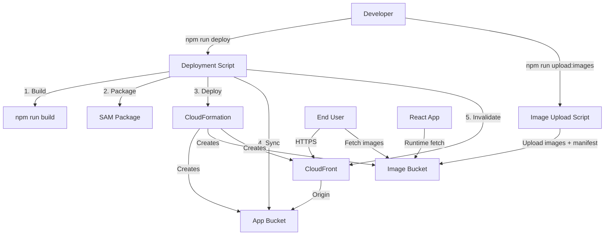

# Design Document: AWS Deployment

## Overview

This design describes the infrastructure and automation for deploying the Pokemon TCG log visualizer React application to AWS. The deployment uses AWS SAM (Serverless Application Model) for infrastructure as code, with a focus on simplicity, cost-effectiveness, and separation of concerns between application code and static assets (card images).

The deployment architecture consists of:
- Two S3 buckets: one for the React application, one for card images
- CloudFront CDN for HTTPS and improved performance
- Automated deployment scripts for both application and images
- SAM template defining all infrastructure as code

This separation allows fast application deployments (without re-uploading 4270+ card images) and independent image updates (without redeploying the application).

## Architecture

### High-Level Architecture



### Deployment Flow

1. **Application Deployment**:
   - Developer runs deployment command
   - Script builds React app (`npm run build`)
   - Script packages SAM template
   - Script deploys infrastructure via CloudFormation
   - Script syncs build artifacts to App Bucket
   - Script invalidates CloudFront cache
   - Script outputs CloudFront URL

2. **Image Upload** (Independent):
   - Developer runs image upload script
   - Script uploads card images from `public/card-images/`
   - Script uploads manifest.json
   - Images are immediately available to application

### Infrastructure Components

#### App Bucket (S3)
- **Purpose**: Host the compiled React application
- **Configuration**: Static website hosting enabled
- **Content**: HTML, CSS, JavaScript files from `/dist`
- **Access**: CloudFront-only (no direct public access)
- **Index Document**: `index.html`
- **Error Document**: `index.html` (for client-side routing)

#### Image Bucket (S3)
- **Purpose**: Store Pokemon TCG card images separately
- **Content**: 4270+ PNG/SVG card images + manifest.json
- **Access**: Public read for all objects
- **Structure**: Preserves directory structure from `public/card-images/`
- **Rationale**: Separation enables fast app deployments and independent image updates

#### CloudFront Distribution
- **Purpose**: HTTPS support and global CDN
- **Origin**: App Bucket (S3 website endpoint)
- **Caching**: Standard caching for static assets
- **Error Handling**: 404 → index.html (200 status) for client-side routing
- **Default Root Object**: `index.html`
- **Price Class**: Default (all edge locations)
- **Pricing**: Pay-as-you-go with no upfront costs or minimum fees

### Technology Stack

- **Infrastructure as Code**: AWS SAM / CloudFormation
- **Compute**: None (static hosting only)
- **Storage**: Amazon S3
- **CDN**: Amazon CloudFront
- **Deployment**: AWS CLI, SAM CLI
- **Build Tool**: Vite (via `npm run build`)
- **Scripting**: Node.js for automation

## Components and Interfaces

### 1. SAM Template (`template.yaml`)

The SAM template defines all AWS resources using CloudFormation syntax.

**Location**: Project root (`template.yaml`)

**Parameters**:
- `StackName`: Unique name for the CloudFormation stack

**Resources**:
- `AppBucket`: S3 bucket for React application
- `AppBucketPolicy`: Bucket policy for CloudFront-only access
- `ImageBucket`: S3 bucket for card images
- `ImageBucketPolicy`: Bucket policy for public read access
- `CloudFrontDistribution`: CloudFront distribution
- `CloudFrontOriginAccessControl`: OAC for secure S3 access

**Outputs**:
- `WebsiteURL`: CloudFront distribution URL
- `AppBucketName`: Name of the app bucket
- `ImageBucketName`: Name of the image bucket
- `ImageBucketURL`: Public URL for image bucket
- `CloudFrontDistributionId`: CloudFront distribution ID for cache invalidation

**Template Structure**:
```yaml
AWSTemplateFormatVersion: '2010-09-09'
Transform: AWS::Serverless-2016-10-31
Description: Pokemon TCG Log Visualizer - Static Site Hosting with CloudFront

Resources:
  # App Bucket, Image Bucket, Policies, CloudFront Distribution

Outputs:
  # CloudFront URL and resource names
```

### 2. Deployment Script

**Purpose**: Automate the full deployment process

**Location**: `scripts/deploy.sh` (bash) or npm script

**Steps**:
1. Validate AWS credentials are configured
2. Build React application: `npm run build`
3. Verify build artifacts exist in `/dist`
4. Package SAM template: `sam package`
5. Deploy SAM template: `sam deploy`
6. Sync build artifacts to App Bucket: `aws s3 sync dist/ s3://{bucket}/`
7. Invalidate CloudFront cache: `aws cloudfront create-invalidation`
8. Output CloudFront URL

**Error Handling**:
- Exit on any command failure
- Validate AWS credentials before starting
- Check for required tools (AWS CLI, SAM CLI, npm)
- Provide clear error messages with remediation steps

**Configuration**:
- Stack name from parameter or default
- AWS region from SAM config or parameter

**Interface**:
```bash
# Basic deployment
npm run deploy

# Custom stack name
npm run deploy -- --stack-name my-tcg-app

# Custom region
npm run deploy -- --region us-west-2
```

### 3. Image Upload Script

**Purpose**: Upload card images independently from app deployment

**Location**: `scripts/upload-images.sh` or `scripts/upload-images.js`

**Steps**:
1. Validate AWS credentials
2. Retrieve Image Bucket name from CloudFormation stack outputs
3. Upload all files from `public/card-images/` to Image Bucket
4. Set appropriate content-type headers (image/png, image/svg+xml)
5. Preserve directory structure
6. Upload manifest.json to bucket root
7. Report upload statistics

**Optimization**:
- Use `aws s3 sync` for efficient uploads (only changed files)
- Parallel uploads for faster processing
- Progress reporting for large uploads

**Error Handling**:
- Check if stack exists before attempting upload
- Validate source directory exists
- Handle network errors with retry logic
- Provide clear error messages

**Interface**:
```bash
# Upload images to deployed stack
npm run upload:images

# Upload to specific stack
npm run upload:images -- --stack-name my-tcg-app

# Dry run (show what would be uploaded)
npm run upload:images -- --dry-run
```

### 4. Build Process Integration

**Current Build Command**: `npm run build` (runs `tsc -b && vite build`)

**Build Output**: `/dist` directory containing:
- `index.html`
- `/assets/*.js` (bundled JavaScript)
- `/assets/*.css` (bundled CSS)
- Other static assets (excluding card images)

**Build Configuration** (vite.config.ts):
- Ensure card images are excluded from build output
- Configure base URL for production (if needed)
- Optimize bundle size and chunking

**Modification Required**:
The build process should NOT include card images in the output. This is likely already configured, but we need to verify and document it.

### 5. React Application Runtime Integration

**Image Loading**:
The React application needs to fetch images from the Image Bucket at runtime.

**Configuration**:
- Environment variable or config file with Image Bucket URL
- Fallback to local images in development
- Manifest.json fetched from Image Bucket

**Implementation Approach**:
```typescript
// config.ts
const IMAGE_BASE_URL = import.meta.env.VITE_IMAGE_BASE_URL || '/card-images';
const MANIFEST_URL = `${IMAGE_BASE_URL}/manifest.json`;

// Image loading service
export function getCardImageUrl(cardId: string): string {
  return `${IMAGE_BASE_URL}/${cardId}.png`;
}

export async function loadManifest(): Promise<Manifest> {
  const response = await fetch(MANIFEST_URL);
  return response.json();
}
```

**Environment Variables**:
- `VITE_IMAGE_BASE_URL`: Set during build to Image Bucket URL
- Deployment script should inject this value

## Data Models

### SAM Template Configuration

```yaml
# Parameter values
EnableCloudFront: boolean (as string 'true'/'false')
StackName: string

# Resource identifiers
AppBucketName: string (generated or specified)
ImageBucketName: string (generated or specified)
CloudFrontDistributionId: string (generated)

# Outputs
WebsiteURL: string (URL)
ImageBucketURL: string (URL)
```

### Deployment Script Configuration

```typescript
interface DeploymentConfig {
  stackName: string;
  region: string;
  samConfigFile?: string;
}

interface DeploymentResult {
  success: boolean;
  websiteUrl: string;
  appBucketName: string;
  imageBucketName: string;
  imageBucketUrl: string;
  cloudFrontDistributionId: string;
  error?: string;
}
```

### Image Upload Configuration

```typescript
interface ImageUploadConfig {
  stackName: string;
  region: string;
  sourceDir: string; // default: 'public/card-images'
  dryRun: boolean;
}

interface ImageUploadResult {
  success: boolean;
  filesUploaded: number;
  filesSkipped: number;
  totalSize: number;
  duration: number;
  error?: string;
}
```

### Manifest Structure (Existing)

```typescript
interface Manifest {
  version: number;
  downloadedAt: string; // ISO 8601
  cards: CardEntry[];
  byName: Record<string, CardEntry[]>;
}

interface CardEntry {
  id: string;
  name: string;
  set: string;
  setId: string;
  releaseDate: string;
  filename: string;
}
```


## Correctness Properties

*A property is a characteristic or behavior that should hold true across all valid executions of a system—essentially, a formal statement about what the system should do. Properties serve as the bridge between human-readable specifications and machine-verifiable correctness guarantees.*

### Property 1: Build artifact directory existence

*For any* successful build execution, the build artifact directory (`/dist`) should exist after the build completes.

**Validates: Requirements 1.2**

### Property 2: Build artifact content correctness

*For any* successful build execution, the build artifact directory should contain all compiled JavaScript, CSS, and HTML files, and should NOT contain any card image files from the `public/card-images` directory.

**Validates: Requirements 1.4, 1.5, 7.4**

### Property 3: Build failure halts deployment

*For any* build command failure, the deployment system should halt execution and report the error without proceeding to subsequent deployment steps.

**Validates: Requirements 1.3**

### Property 4: SAM template validation

*For any* version of the SAM template, it should be valid according to AWS SAM/CloudFormation syntax validation rules.

**Validates: Requirements 5.2**

### Property 5: Deployment failure handling

*For any* deployment step failure (build, package, deploy, sync), the deployment system should halt execution and report the specific error that occurred.

**Validates: Requirements 6.7**

### Property 6: Deployment success output

*For any* successful deployment, the deployment system should output the CloudFront distribution URL.

**Validates: Requirements 6.6**

### Property 7: Image upload directory structure preservation

*For any* set of card image files uploaded, the image upload script should preserve the directory structure from the source directory when uploading to the Image Bucket.

**Validates: Requirements 8.3**

### Property 8: Image upload content-type headers

*For any* card image file uploaded, the image upload script should set the content-type header to `image/png` for PNG files and `image/svg+xml` for SVG files.

**Validates: Requirements 8.4**

### Property 9: Image bucket missing error

*For any* execution of the image upload script when the Image Bucket does not exist, the script should report an error with instructions on how to deploy the infrastructure first.

**Validates: Requirements 8.7**

### Property 10: AWS region configuration

*For any* deployment execution with a specified AWS region parameter, the deployment system should use that region for all AWS operations.

**Validates: Requirements 10.2**

### Property 11: Stack name configuration

*For any* deployment execution with a specified stack name parameter, the deployment system should use that stack name for the CloudFormation stack.

**Validates: Requirements 10.3**

### Property 12: AWS credentials validation

*For any* deployment execution, the deployment system should validate that AWS credentials are configured before attempting any AWS operations, and should report an error with instructions if credentials are missing.

**Validates: Requirements 10.4, 10.5**

The following are specific examples that should be verified in the SAM template:

**Example 1: App Bucket Configuration**
- Template defines an S3 bucket resource for the app
- Bucket has static website hosting enabled
- Index document is set to "index.html"
- Error document is set to "index.html"

**Validates: Requirements 2.1, 2.2, 2.3**

**Example 2: Bucket Policy Configuration**
- Template defines bucket policy restricting direct access
- Policy allows CloudFront-only access to the App Bucket

**Validates: Requirements 3.1, 3.2, 3.3**

**Example 3: CloudFront Configuration**
- Template defines CloudFront distribution
- Distribution uses HTTPS for client connections
- Distribution has default root object "index.html"
- Distribution handles 404 errors by serving index.html with 200 status
- Distribution uses standard caching rules
- Distribution uses pay-as-you-go pricing

**Validates: Requirements 4.1, 4.2, 4.3, 4.4, 4.5, 4.6**

**Example 4: Template Structure**
- Template file named "template.yaml" exists in project root
- Template outputs WebsiteURL (CloudFront distribution URL)
- Template outputs CloudFront distribution ID

**Validates: Requirements 5.1, 5.3, 5.4**

**Example 5: Deployment Script Steps**
- Script executes npm run build
- Script executes sam package
- Script executes sam deploy
- Script executes aws s3 sync
- Script executes cloudfront invalidation

**Validates: Requirements 6.1, 6.2, 6.3, 6.4, 6.5**

**Example 6: Image Bucket Configuration**
- Template defines separate Image Bucket resource
- Image Bucket has public read access policy
- Template outputs Image Bucket URL

**Validates: Requirements 7.1, 7.2, 7.3, 7.6**

**Example 7: Image Upload Script**
- Script exists and is executable
- Script uploads manifest.json to bucket root
- Script uploads manifest when images are uploaded

**Validates: Requirements 8.1, 9.1, 9.2, 9.5**

**Example 8: Cost Optimization Configuration**
- Template uses S3 Standard storage class
- CloudFront uses pay-as-you-go pricing with no upfront costs
- Template uses default CloudFront price class
- Template defines only necessary resources (2 buckets, CloudFront)

**Validates: Requirements 12.1, 12.2, 12.3, 12.4**

## Error Handling

### Build Errors

**Scenario**: Build command fails (TypeScript errors, missing dependencies, etc.)

**Handling**:
- Deployment script exits immediately with non-zero status
- Error message includes build command output
- No AWS operations are attempted
- User is directed to fix build errors and retry

### AWS Credential Errors

**Scenario**: AWS credentials not configured or invalid

**Handling**:
- Deployment script validates credentials before any operations
- Clear error message: "AWS credentials not found. Please configure credentials using 'aws configure' or set AWS_ACCESS_KEY_ID and AWS_SECRET_ACCESS_KEY environment variables."
- Script exits with non-zero status
- No AWS operations are attempted

### SAM Template Errors

**Scenario**: Template validation fails or deployment fails

**Handling**:
- SAM CLI provides detailed error messages
- Deployment script captures and displays SAM errors
- Script exits with non-zero status
- User is directed to check template syntax or CloudFormation events

### S3 Sync Errors

**Scenario**: File upload to S3 fails (permissions, network, etc.)

**Handling**:
- AWS CLI provides error details
- Deployment script captures and displays errors
- Script exits with non-zero status
- Partial uploads may exist (S3 sync is idempotent, safe to retry)

### Image Bucket Missing

**Scenario**: Image upload script run before infrastructure deployed

**Handling**:
- Script attempts to retrieve bucket name from CloudFormation stack
- If stack doesn't exist, error message: "CloudFormation stack '{stackName}' not found. Please deploy the infrastructure first using 'npm run deploy'."
- Script exits with non-zero status
- No upload attempts are made

### CloudFront Invalidation Errors

**Scenario**: Cache invalidation fails after deployment

**Handling**:
- Deployment script logs error and exits with non-zero status
- Error message includes CloudFront distribution ID
- User is directed to check permissions or manually invalidate cache
- Deployment is considered failed if invalidation cannot be initiated

### Network Errors

**Scenario**: Network connectivity issues during deployment or upload

**Handling**:
- AWS CLI and SAM CLI have built-in retry logic
- After retries exhausted, error is reported
- Script exits with non-zero status
- User is directed to check network connectivity and retry

### Partial Deployment State

**Scenario**: Deployment partially succeeds (infrastructure created but file sync fails)

**Handling**:
- CloudFormation stack exists and is functional
- Re-running deployment script will sync files without recreating infrastructure
- SAM deploy is idempotent (safe to retry)
- S3 sync is idempotent (safe to retry)

## Testing Strategy

### Unit Testing

Unit tests will verify specific examples and edge cases for the deployment infrastructure:

**SAM Template Tests**:
- Verify template is valid YAML
- Verify all required resources are defined
- Verify output definitions
- Verify bucket policies have correct permissions
- Verify CloudFront configuration

**Deployment Script Tests**:
- Verify script validates AWS credentials before proceeding
- Verify script executes commands in correct order
- Verify script handles build failures correctly
- Verify script handles SAM deployment failures correctly
- Verify script outputs CloudFront URL
- Verify script invalidates CloudFront cache
- Verify script accepts and uses configuration parameters

**Image Upload Script Tests**:
- Verify script validates bucket exists before upload
- Verify script handles missing bucket gracefully
- Verify script uploads manifest.json to correct location
- Verify script sets correct content-type headers
- Verify script preserves directory structure

**Configuration Tests**:
- Verify environment variable handling
- Verify parameter parsing
- Verify default values are applied correctly

### Property-Based Testing

Property-based tests will verify universal properties across all inputs using fast-check library (minimum 100 iterations per test):

**Property Test 1: Build Artifact Directory Existence**
- Generate various build scenarios
- Verify dist directory exists after successful builds
- **Feature: aws-deployment, Property 1: For any successful build execution, the build artifact directory should exist after the build completes**

**Property Test 2: Build Artifact Content Correctness**
- Generate various build outputs
- Verify compiled files are present and card images are absent
- **Feature: aws-deployment, Property 2: For any successful build execution, the build artifact directory should contain all compiled files and should NOT contain card image files**

**Property Test 3: Build Failure Halts Deployment**
- Generate various build failure scenarios
- Verify deployment halts and reports errors
- **Feature: aws-deployment, Property 3: For any build command failure, the deployment system should halt execution and report the error**

**Property Test 4: SAM Template Validation**
- Generate template variations
- Verify all templates pass AWS SAM validation
- **Feature: aws-deployment, Property 4: For any version of the SAM template, it should be valid according to AWS SAM/CloudFormation syntax**

**Property Test 5: Deployment Failure Handling**
- Generate failures at different deployment steps
- Verify system halts and reports specific errors
- **Feature: aws-deployment, Property 5: For any deployment step failure, the deployment system should halt execution and report the error**

**Property Test 6: Deployment Success Output**
- Generate various successful deployment scenarios
- Verify CloudFront URL is always output
- **Feature: aws-deployment, Property 6: For any successful deployment, the deployment system should output the CloudFront distribution URL**

**Property Test 7: Image Upload Directory Structure Preservation**
- Generate various directory structures
- Verify structure is preserved in S3 paths
- **Feature: aws-deployment, Property 7: For any set of card image files uploaded, the image upload script should preserve the directory structure**

**Property Test 8: Image Upload Content-Type Headers**
- Generate various image file types (PNG, SVG)
- Verify correct content-type headers are set
- **Feature: aws-deployment, Property 8: For any card image file uploaded, the image upload script should set the correct content-type header**

**Property Test 9: Image Bucket Missing Error**
- Generate scenarios where bucket doesn't exist
- Verify error is reported with instructions
- **Feature: aws-deployment, Property 9: For any execution when the Image Bucket does not exist, the script should report an error with instructions**

**Property Test 10: AWS Region Configuration**
- Generate various region parameters
- Verify region is used for all AWS operations
- **Feature: aws-deployment, Property 10: For any deployment execution with a specified AWS region parameter, the deployment system should use that region**

**Property Test 11: Stack Name Configuration**
- Generate various stack name parameters
- Verify stack name is used for CloudFormation stack
- **Feature: aws-deployment, Property 11: For any deployment execution with a specified stack name parameter, the deployment system should use that stack name**

**Property Test 12: AWS Credentials Validation**
- Generate scenarios with missing/invalid credentials
- Verify validation occurs and errors are reported
- **Feature: aws-deployment, Property 12: For any deployment execution, the deployment system should validate AWS credentials and report errors if missing**

### Integration Testing

Integration tests will verify the complete deployment flow in a test AWS account:

**Full Deployment Test**:
- Deploy infrastructure with CloudFront
- Verify S3 buckets are created
- Verify CloudFront distribution is created
- Verify HTTPS access works
- Upload images
- Verify images are accessible
- Update application
- Verify update is deployed
- Verify cache invalidation works

**Update Deployment Test**:
- Deploy initial version
- Make code changes
- Deploy update
- Verify changes are live after cache invalidation
- Verify images are not re-uploaded

**Independent Image Update Test**:
- Deploy infrastructure
- Upload initial images
- Add new images
- Run image upload script
- Verify new images are accessible
- Verify application was not redeployed

### Testing Tools

- **Unit Tests**: Vitest (already in project)
- **Property-Based Tests**: fast-check (already in project)
- **Template Validation**: AWS SAM CLI (`sam validate`)
- **Integration Tests**: AWS CLI, curl/wget for endpoint testing
- **Mocking**: Vitest mocking for AWS CLI commands in unit tests

### Test Coverage Goals

- 100% of correctness properties covered by property-based tests
- 100% of template structure examples covered by unit tests
- 100% of error handling scenarios covered by unit tests
- Integration tests covering all deployment scenarios (CloudFront deployment, updates, image uploads)

