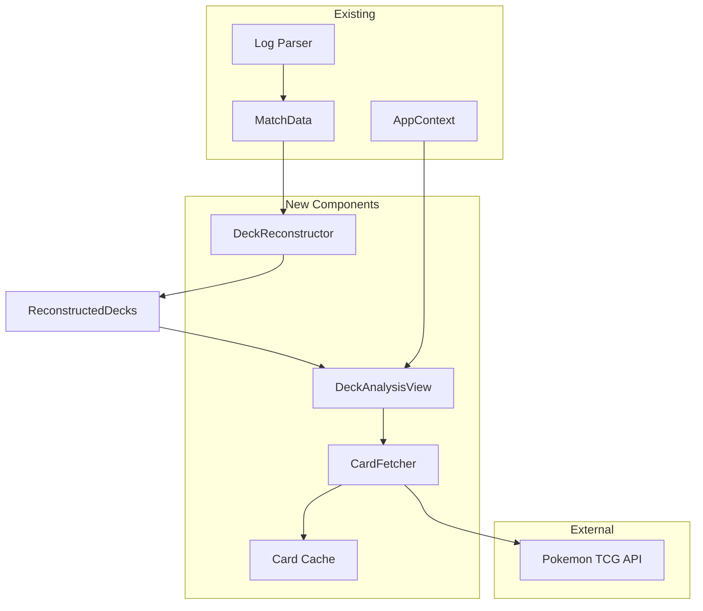

# Design Document: Deck Reconstruction

## Overview

The Deck Reconstruction feature adds a third view to the Pokemon TCG Log Visualizer that analyzes parsed game logs to reconstruct each player's deck. The system extracts card information from game events, categorizes cards, tracks counts, and fetches official card images from the Pokemon TCG API.

The architecture follows the existing application patterns:
- A new service layer (`DeckReconstructor`) processes `MatchData` to extract deck information
- A new API service (`CardFetcher`) integrates with the Pokemon TCG SDK for card images
- A new view component (`DeckAnalysisView`) displays the reconstructed decks
- State management extends the existing `AppContext` pattern

## Architecture



### Data Flow

1. User submits a game log (existing flow)
2. Parser creates `MatchData` with events (existing flow)
3. `DeckReconstructor` processes events to build `ReconstructedDeck` for each player
4. `DeckAnalysisView` renders deck lists and requests card images
5. `CardFetcher` queries Pokemon TCG API with caching and rate limiting
6. Card images are displayed in the view

## Components and Interfaces

### DeckReconstructor Service

Responsible for extracting card information from parsed game events.

```typescript
interface DeckReconstructor {
  /**
   * Reconstruct decks for both players from match data
   * @param matchData - Parsed match data containing events
   * @returns Reconstructed decks for both players
   */
  reconstructDecks(matchData: MatchData): PlayerDecks;
}
```

**Implementation approach:**
- Iterate through all `GameEvent` objects in `matchData.events`
- Extract card names based on event type:
  - `play_pokemon`: Extract `pokemonName` from details
  - `evolve`: Extract both `pokemonName` (evolution) and `evolvedFrom` (base)
  - `play_trainer`: Extract `trainerName` and `trainerCategory` from details
  - `attach_energy`: Extract energy name from description (parse "attached X to Y")
  - `draw`: Extract `cardNames` from details when available
- Track card counts per player using a Map structure
- Determine confidence level based on event type (played = confirmed, drawn = confirmed)

### CardFetcher Service

Handles Pokemon TCG API integration with caching and rate limiting.

```typescript
interface CardFetcher {
  /**
   * Fetch card data including images for a list of card names
   * @param cardNames - Array of card names to fetch
   * @returns Map of card name to card data
   */
  fetchCards(cardNames: string[]): Promise<Map<string, CardData>>;
  
  /**
   * Fetch a single card by name
   * @param cardName - Name of the card to fetch
   * @returns Card data or null if not found
   */
  fetchCard(cardName: string): Promise<CardData | null>;
}
```

**Implementation approach:**
- Use `pokemon-tcg-sdk-typescript` library's `Card.where()` method
- Implement in-memory cache using `Map<string, CardData>`
- Rate limiting: Queue requests, process with delays (max 30/minute without API key)
- Handle multiple versions by selecting most recent set release date
- Return placeholder data when card not found

### DeckAnalysisView Component

React component for displaying reconstructed decks.

```typescript
interface DeckAnalysisViewProps {
  matchData: MatchData;
  playerDecks: PlayerDecks;
}
```

**Component structure:**
- Header with view title and disclaimer about partial reconstruction
- Two-column layout for player decks (similar to StatisticsView)
- Card category sections (Pokemon, Trainers, Energy)
- Card grid within each section showing image, name, count
- Hover state for enlarged card view
- Loading states for card images

### Card Display Component

Reusable component for rendering individual cards.

```typescript
interface DeckCardDisplayProps {
  card: DeckCard;
  cardData: CardData | null;
  isLoading: boolean;
}
```

## Data Models

### Core Types

```typescript
/**
 * Confidence level for card presence in deck
 */
type ConfidenceLevel = 'confirmed' | 'inferred';

/**
 * Card category for grouping
 */
type CardCategory = 'pokemon' | 'trainer' | 'energy';

/**
 * Trainer subcategory
 */
type TrainerSubcategory = 'supporter' | 'item' | 'tool' | 'stadium';

/**
 * Energy subcategory
 */
type EnergySubcategory = 'basic' | 'special';

/**
 * A card entry in a reconstructed deck
 */
interface DeckCard {
  name: string;
  category: CardCategory;
  subcategory?: TrainerSubcategory | EnergySubcategory;
  count: number;
  minCount: number; // For uncertain counts, minCount <= count
  confidence: ConfidenceLevel;
  evolutionStage?: number; // 0 = basic, 1 = stage 1, 2 = stage 2
  evolvesFrom?: string; // Name of pre-evolution
}

/**
 * Reconstructed deck for a single player
 */
interface ReconstructedDeck {
  playerName: string;
  cards: DeckCard[];
  totalCardsObserved: number;
  pokemon: DeckCard[];
  trainers: {
    supporters: DeckCard[];
    items: DeckCard[];
    tools: DeckCard[];
    stadiums: DeckCard[];
  };
  energy: {
    basic: DeckCard[];
    special: DeckCard[];
  };
}

/**
 * Decks for both players
 */
interface PlayerDecks {
  [playerName: string]: ReconstructedDeck;
}

/**
 * Card data from Pokemon TCG API
 */
interface CardData {
  id: string;
  name: string;
  supertype: string; // 'Pokémon', 'Trainer', 'Energy'
  subtypes?: string[]; // ['Basic', 'Stage 1'], ['Supporter'], etc.
  imageUrl: string;
  imageUrlHiRes: string;
  setName: string;
  setReleaseDate: string;
  isPlaceholder: boolean;
}

/**
 * Card fetch result with loading state
 */
interface CardFetchState {
  data: CardData | null;
  isLoading: boolean;
  error: string | null;
}
```

### Energy Classification

Special energies are identified by name patterns:
- Basic Energy: "Basic [Type] Energy" (e.g., "Basic Water Energy")
- Special Energy: All other energy cards (e.g., "Reversal Energy", "Ignition Energy")

```typescript
const BASIC_ENERGY_PATTERN = /^Basic \w+ Energy$/;

function isBasicEnergy(energyName: string): boolean {
  return BASIC_ENERGY_PATTERN.test(energyName);
}
```

### Evolution Line Tracking

Pokemon are organized by evolution line when possible:

```typescript
interface EvolutionLine {
  basic: string;
  stage1?: string;
  stage2?: string;
}

// Built from evolve events in the log
// e.g., Dreepy -> Drakloak -> Dragapult
```


## Correctness Properties

*A property is a characteristic or behavior that should hold true across all valid executions of a system—essentially, a formal statement about what the system should do. Properties serve as the bridge between human-readable specifications and machine-verifiable correctness guarantees.*

### Property 1: Card Extraction Completeness

*For any* game event that contains a card name (play_pokemon, evolve, play_trainer, attach_energy, or draw with revealed cards), that card name SHALL appear in the reconstructed deck for the corresponding player.

**Validates: Requirements 1.1, 1.2, 1.3, 1.4, 1.6**

### Property 2: Card Count Accuracy

*For any* reconstructed deck, the count for each card SHALL equal the number of distinct instances of that card observed across all events, where a card played, evolved, and knocked out counts as one instance, and SHALL be capped at 4 copies for all cards except Basic Energy (which has no limit per Pokemon TCG rules).

**Validates: Requirements 2.1, 2.2**

### Property 3: Display Format Correctness

*For any* DeckCard with a count, the formatted display string SHALL be "Card Name x N" when count equals minCount, or "Card Name (at least N)" when minCount is less than count.

**Validates: Requirements 2.3, 2.4**

### Property 4: Card Categorization Correctness

*For any* card in a reconstructed deck, it SHALL be assigned to exactly one category (Pokemon, Trainer, or Energy), and Trainer cards SHALL be assigned to exactly one subcategory (Supporter, Item, Tool, or Stadium), and Energy cards SHALL be classified as Basic or Special based on the name pattern.

**Validates: Requirements 3.1, 3.2, 3.4**

### Property 5: Pokemon Evolution Sorting

*For any* list of Pokemon cards with known evolution relationships, when sorted, basic Pokemon SHALL appear before their Stage 1 evolutions, and Stage 1 evolutions SHALL appear before their Stage 2 evolutions.

**Validates: Requirements 3.3**

### Property 6: Card Version Selection

*For any* card name that returns multiple results from the Pokemon TCG API, the CardFetcher SHALL select the card with the most recent setReleaseDate.

**Validates: Requirements 4.3**

### Property 7: Cache Consistency

*For any* card name, fetching it multiple times within a session SHALL return the same CardData object, and subsequent fetches SHALL not trigger additional API calls.

**Validates: Requirements 4.5**

### Property 8: Card Display Completeness

*For any* rendered card in the DeckAnalysisView, the output SHALL contain the card name, the observed count, and either the card image or a placeholder.

**Validates: Requirements 5.3**

### Property 9: Summary Calculation Correctness

*For any* reconstructed deck, the total cards observed in the summary SHALL equal the sum of counts across all cards in all categories (Pokemon + Trainers + Energy).

**Validates: Requirements 5.4**

### Property 10: Confidence Assignment and Display

*For any* card extracted from a play, evolve, attach, or draw event, it SHALL be marked with confidence level "confirmed", and cards with different confidence levels SHALL have distinct CSS class names applied.

**Validates: Requirements 6.1, 6.3**

### Property 11: Error Resilience

*For any* sequence of game events where some events contain malformed data, the DeckReconstructor SHALL successfully process all valid events and include their cards in the result, and *for any* set of card fetches where some fail, the successfully fetched cards SHALL still be displayed correctly.

**Validates: Requirements 7.2, 7.4**

## Error Handling

### Pattern Matching Safeguards

To prevent false positives in card extraction, the following safeguards are implemented:

1. **Card name patterns require capital letters**: Patterns like `drewCard` and `playedPokemon` require card names to start with a capital letter (e.g., `[A-Z]`), preventing extraction of generic phrases like "a card" or "to the bench"
2. **Card count limits**: All cards except Basic Energy are capped at 4 copies per deck, following Pokemon TCG rules
3. **Skip patterns for metadata**: Lines containing metadata (damage breakdowns, shuffle notifications, etc.) are explicitly skipped during parsing

### API Errors

| Error Type | Detection | Response |
|------------|-----------|----------|
| API Unavailable | Network error or 5xx response | Display deck with names only, show error banner |
| Rate Limited | 429 response | Queue remaining requests, show "Loading images..." message |
| Card Not Found | Empty search results | Create placeholder CardData with isPlaceholder=true |
| Image Load Failure | Image onError event | Display fallback placeholder, log error |

### Reconstruction Errors

| Error Type | Detection | Response |
|------------|-----------|----------|
| Malformed Event | Missing required fields | Log warning, skip event, continue processing |
| Unknown Card Category | Card doesn't match known patterns | Default to 'trainer' category with 'item' subcategory |
| Invalid Player | Event player not in match players | Log warning, skip event |

### Error State Management

```typescript
interface DeckAnalysisState {
  playerDecks: PlayerDecks | null;
  cardData: Map<string, CardFetchState>;
  apiError: string | null;
  isLoadingImages: boolean;
  failedCards: string[]; // Cards that failed to fetch
}
```

### Graceful Degradation

1. **Full API failure**: Show deck lists with card names and counts, no images
2. **Partial image failure**: Show loaded images, placeholders for failed cards
3. **Rate limiting**: Progressive image loading with status indicator
4. **Reconstruction errors**: Partial deck with warning about incomplete data

## Testing Strategy

### Unit Tests

Unit tests verify specific examples and edge cases:

- Card extraction from each event type (play_pokemon, evolve, play_trainer, attach_energy, draw)
- Energy classification (Basic vs Special)
- Trainer subcategorization
- Evolution line building from evolve events
- Display format strings for various count scenarios
- Error handling for malformed events

### Property-Based Tests

Property-based tests verify universal properties across randomly generated inputs. Each property test MUST:
- Run a minimum of 100 iterations
- Reference the design document property it validates
- Use tag format: **Feature: deck-reconstruction, Property N: [property text]**

**Testing Library**: Use `fast-check` for TypeScript property-based testing.

**Generators needed**:
- `arbitraryGameEvent`: Generate random valid GameEvent objects
- `arbitraryMatchData`: Generate MatchData with random events for both players
- `arbitraryDeckCard`: Generate random DeckCard objects
- `arbitraryCardData`: Generate random CardData API responses

### Integration Tests

- Pokemon TCG API integration (with mocked responses)
- Full reconstruction flow from MatchData to rendered view
- Tab navigation between Timeline, Statistics, and Deck Analysis views

### Test Coverage Matrix

| Requirement | Unit Test | Property Test | Integration Test |
|-------------|-----------|---------------|------------------|
| 1.1-1.6 Card Extraction | ✓ | Property 1 | ✓ |
| 2.1-2.2 Card Counting | ✓ | Property 2 | |
| 2.3-2.4 Display Format | ✓ | Property 3 | |
| 3.1-3.4 Categorization | ✓ | Property 4, 5 | |
| 4.3 Version Selection | | Property 6 | ✓ |
| 4.5 Caching | | Property 7 | ✓ |
| 5.3 Card Display | ✓ | Property 8 | ✓ |
| 5.4 Summary | ✓ | Property 9 | |
| 6.1, 6.3 Confidence | ✓ | Property 10 | |
| 7.2, 7.4 Error Handling | ✓ | Property 11 | ✓ |
