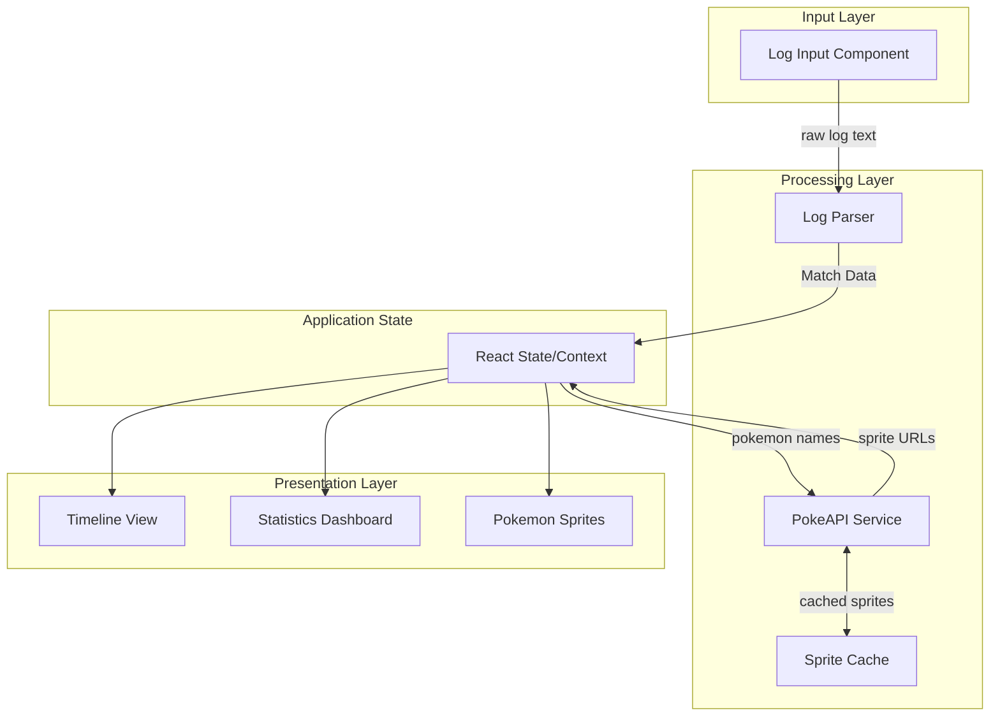
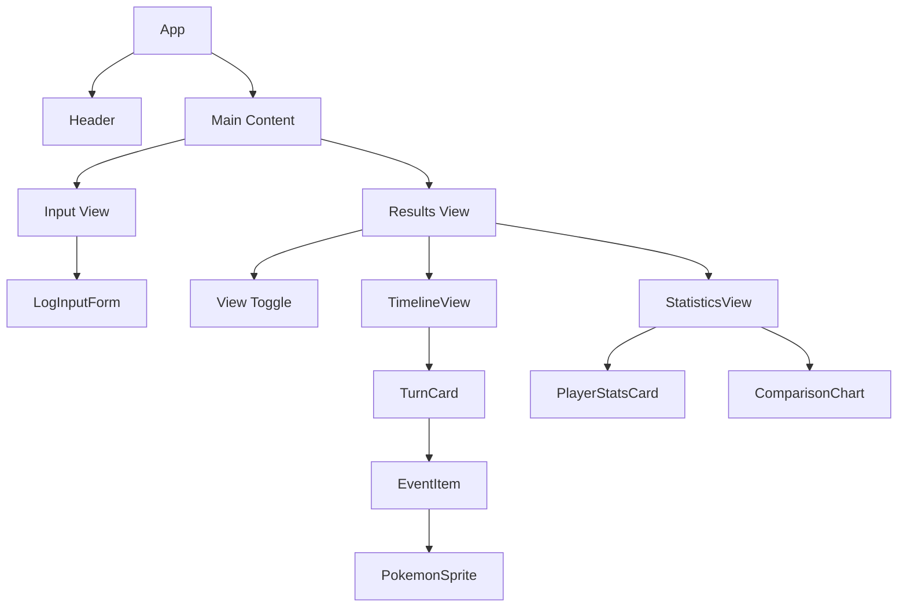
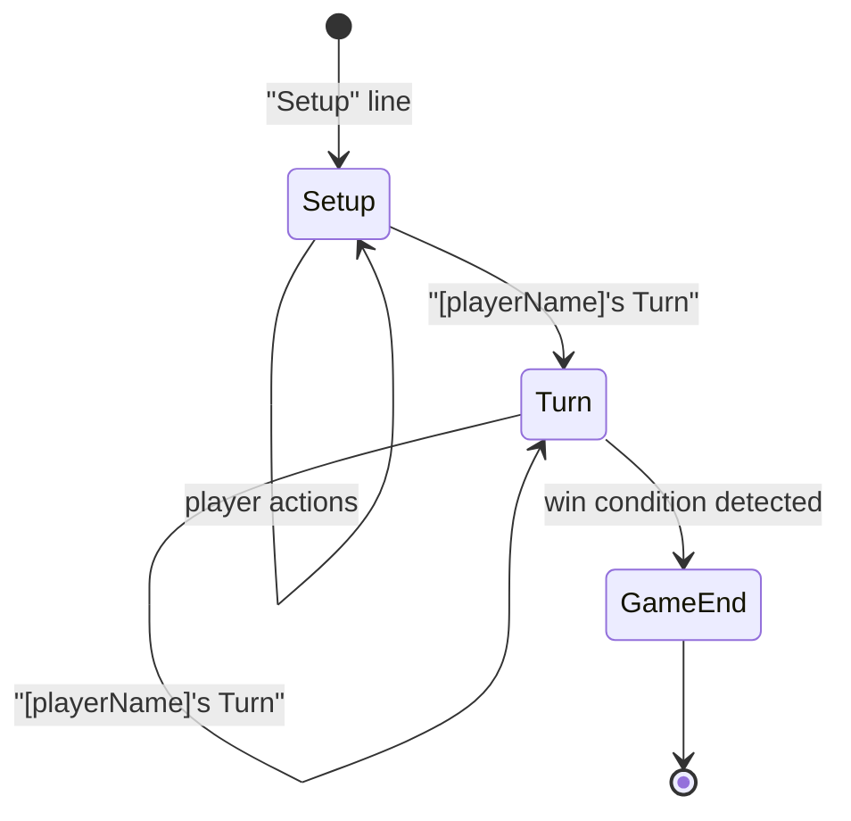

# Design Document: Pokemon TCG Log Visualizer

## Overview

The Pokemon TCG Log Visualizer is a single-page React application that transforms raw Pokemon TCG Live game logs into an interactive visual experience. The application follows a unidirectional data flow architecture where the log parser produces immutable match data that flows through to visualization components.

The system consists of three main layers:
1. **Input Layer** - Handles user input and log submission
2. **Processing Layer** - Parses logs and fetches Pokemon sprites
3. **Presentation Layer** - Renders timeline, statistics, and Pokemon imagery

## Architecture



### Data Flow

1. User pastes log text into the input component
2. On submission, the Log Parser processes the text synchronously
3. Parsed Match Data is stored in React state
4. PokeAPI Service fetches sprites for unique Pokemon (with caching)
5. Presentation components render from the centralized state

## Components and Interfaces

### Component Hierarchy



### Core Interfaces

```typescript
// Player identification
interface Player {
  username: string;
  isFirst: boolean;  // went first in the match
}

// Individual game event
interface GameEvent {
  id: string;
  turn: number;
  player: string;
  type: EventType;
  description: string;
  details: EventDetails;
  timestamp: number;  // relative ordering within turn
}

type EventType = 
  | 'draw'
  | 'play_pokemon'
  | 'evolve'
  | 'attach_energy'
  | 'play_trainer'
  | 'use_ability'
  | 'attack'
  | 'knockout'
  | 'prize_taken'
  | 'switch'
  | 'coin_flip'
  | 'mulligan'
  | 'win';

// Event-specific details
interface EventDetails {
  // For attacks
  attackName?: string;
  attackingPokemon?: string;
  targetPokemon?: string;
  damage?: number;
  damageBreakdown?: string;
  
  // For trainer cards
  trainerName?: string;
  trainerCategory?: TrainerCategory;
  
  // For Pokemon plays/evolves
  pokemonName?: string;
  location?: 'active' | 'bench';
  evolvedFrom?: string;
  
  // For draws
  cardCount?: number;
  cardNames?: string[];
  
  // For knockouts
  knockedOutPokemon?: string;
  prizesTaken?: number;
  
  // For coin flips
  result?: 'heads' | 'tails';
  headsCount?: number;
  tailsCount?: number;
  
  // For win condition
  winCondition?: WinCondition;
}

type TrainerCategory = 'supporter' | 'item' | 'tool' | 'stadium';
type WinCondition = 'prizes' | 'deck_out' | 'no_pokemon' | 'concede';

// Complete match data structure
interface MatchData {
  players: [Player, Player];
  coinFlipWinner: string;
  coinFlipChoice: 'first' | 'second';
  turns: Turn[];
  events: GameEvent[];
  winner: string;
  winCondition: WinCondition;
  statistics: MatchStatistics;
  pokemonInMatch: string[];
}

// Single turn container
interface Turn {
  number: number;
  player: string;
  events: GameEvent[];
}

// Aggregated statistics
interface MatchStatistics {
  [playerUsername: string]: PlayerStatistics;
}

interface PlayerStatistics {
  totalDamageDealt: number;
  totalCardsDrawn: number;
  trainersPlayed: {
    supporters: TrainerPlayCount[];
    items: TrainerPlayCount[];
    tools: TrainerPlayCount[];
    stadiums: TrainerPlayCount[];
  };
  pokemonKnockedOut: number;
  prizeCardsTaken: number;
  coinFlips: {
    heads: number;
    tails: number;
  };
  turnsPlayed: number;
}

interface TrainerPlayCount {
  name: string;
  count: number;
}

// Pokemon sprite data
interface PokemonSprite {
  name: string;
  spriteUrl: string | null;
  isLoading: boolean;
  error: string | null;
}

// Application state
interface AppState {
  view: 'input' | 'results';
  rawLog: string;
  matchData: MatchData | null;
  sprites: Map<string, PokemonSprite>;
  isLoading: boolean;
  error: string | null;
}
```

### Component Props Interfaces

```typescript
interface LogInputFormProps {
  onSubmit: (logText: string) => void;
  isLoading: boolean;
}

interface TimelineViewProps {
  matchData: MatchData;
  sprites: Map<string, PokemonSprite>;
}

interface TurnCardProps {
  turn: Turn;
  playerColors: Map<string, string>;
  sprites: Map<string, PokemonSprite>;
  isExpanded: boolean;
  onToggle: () => void;
}

interface EventItemProps {
  event: GameEvent;
  sprites: Map<string, PokemonSprite>;
  isHighlighted: boolean;
}

interface StatisticsViewProps {
  matchData: MatchData;
  sprites: Map<string, PokemonSprite>;
}

interface PlayerStatsCardProps {
  player: Player;
  stats: PlayerStatistics;
  sprites: Map<string, PokemonSprite>;
}

interface PokemonSpriteProps {
  pokemonName: string;
  sprite: PokemonSprite | undefined;
  size?: 'small' | 'medium' | 'large';
}
```

## Data Models

### Log Parser State Machine

The parser processes the log line-by-line using a state machine:



### Parser Regex Patterns

```typescript
const PATTERNS = {
  // Setup phase
  coinFlipChoice: /^(\w+) chose (heads|tails) for the opening coin flip/,
  coinFlipWinner: /^(\w+) won the coin toss/,
  goFirst: /^(\w+) decided to go (first|second)/,
  openingHand: /^(\w+) drew (\d+) cards for the opening hand/,
  mulligan: /^(\w+) took a mulligan/,
  
  // Turn markers
  turnStart: /^\[playerName\]'s Turn$/,
  
  // Actions
  drewCard: /^(\w+) drew (.+)\.?$/,
  drewCards: /^(\w+) drew (\d+) cards/,
  playedPokemon: /^(\w+) played (\w+(?:\s+\w+)*) to the (Active Spot|Bench)/,
  evolved: /^(\w+) evolved (\w+(?:\s+\w+)*) to (\w+(?:\s+\w+)*)/,
  attachedEnergy: /^(\w+) attached (.+) to (\w+(?:\s+\w+)*)/,
  playedTrainer: /^(\w+) played (\w+(?:'s)?\s*\w*)/,
  usedAbility: /^(\w+)'s (\w+(?:\s+\w+)*) used (\w+(?:\s+\w+)*)/,
  attack: /^(\w+)'s (\w+(?:\s+\w+)*) used (\w+(?:\s+\w+)*) on (\w+)'s (\w+(?:\s+\w+)*) for (\d+) damage/,
  knockout: /^(\w+)'s (\w+(?:\s+\w+)*) was Knocked Out/,
  prizeTaken: /^(\w+) took a Prize card/,
  switched: /^(\w+)'s (\w+(?:\s+\w+)*) is now in the Active Spot/,
  
  // Coin flips
  coinFlip: /flipped (\d+) coins?, and (\d+) landed on heads/,
  
  // Win conditions
  deckOut: /Opponent's deck ran out of cards\. (\w+) wins/,
  prizeWin: /(\w+) took all Prize cards/,
  
  // Damage breakdown
  damageBreakdown: /Damage breakdown:/,
};
```

### Trainer Card Classification

Trainer cards are classified based on usage patterns in the log:

| Category | Identification Pattern |
|----------|----------------------|
| Supporter | Followed by "drew X cards" or "shuffled" actions |
| Item | Single-use effects (Nest Ball, Ultra Ball, Rare Candy) |
| Tool | "attached X to Pokemon" pattern |
| Stadium | "played X to the Stadium spot" |

Known trainer card mappings:
```typescript
const TRAINER_CATEGORIES: Record<string, TrainerCategory> = {
  // Supporters
  'Arven': 'supporter',
  'Hilda': 'supporter',
  'Iono': 'supporter',
  'Boss\'s Orders': 'supporter',
  'Professor\'s Research': 'supporter',
  'Lillie\'s Determination': 'supporter',
  'Dawn': 'supporter',
  'Xerosic\'s Machinations': 'supporter',
  
  // Items
  'Nest Ball': 'item',
  'Ultra Ball': 'item',
  'Rare Candy': 'item',
  'Counter Catcher': 'item',
  'Buddy-Buddy Poffin': 'item',
  'Precious Trolley': 'item',
  'Redeemable Ticket': 'item',
  'Sacred Ash': 'item',
  
  // Tools
  'Gravity Gemstone': 'tool',
  'Air Balloon': 'tool',
  
  // Stadiums
  'Artazon': 'stadium',
  'Surfing Beach': 'stadium',
};
```

### PokeAPI Integration

```typescript
interface PokeAPIResponse {
  id: number;
  name: string;
  sprites: {
    front_default: string | null;
    other: {
      'official-artwork': {
        front_default: string | null;
      };
    };
  };
}

// Name normalization for API lookup
function normalizePokemonName(name: string): string {
  return name
    .toLowerCase()
    .replace(/\s+ex$/i, '')           // Remove "ex" suffix
    .replace(/\s+mega$/i, '')         // Remove "mega" suffix  
    .replace(/\s+gx$/i, '')           // Remove "gx" suffix
    .replace(/\s+v$/i, '')            // Remove "v" suffix
    .replace(/\s+vmax$/i, '')         // Remove "vmax" suffix
    .replace(/\s+vstar$/i, '')        // Remove "vstar" suffix
    .replace(/[^a-z0-9-]/g, '')       // Remove special characters
    .trim();
}
```

### Statistics Calculation

Statistics are computed during parsing and stored in the MatchData:

```typescript
function calculateStatistics(events: GameEvent[]): MatchStatistics {
  const stats: MatchStatistics = {};
  
  for (const event of events) {
    const playerStats = getOrCreatePlayerStats(stats, event.player);
    
    switch (event.type) {
      case 'draw':
        playerStats.totalCardsDrawn += event.details.cardCount ?? 1;
        break;
      case 'attack':
        playerStats.totalDamageDealt += event.details.damage ?? 0;
        break;
      case 'knockout':
        // Attribute to the OTHER player (they caused the KO)
        break;
      case 'prize_taken':
        playerStats.prizeCardsTaken += 1;
        break;
      case 'play_trainer':
        categorizeAndCountTrainer(playerStats, event.details);
        break;
      case 'coin_flip':
        playerStats.coinFlips.heads += event.details.headsCount ?? 0;
        playerStats.coinFlips.tails += event.details.tailsCount ?? 0;
        break;
    }
  }
  
  return stats;
}
```


## Correctness Properties

*A property is a characteristic or behavior that should hold true across all valid executions of a system—essentially, a formal statement about what the system should do. Properties serve as the bridge between human-readable specifications and machine-verifiable correctness guarantees.*

### Property 1: Parser Statistics Round-Trip Consistency

*For any* valid Match_Data object, if we serialize the statistics to a summary format and then recalculate statistics from the original events, the statistical totals (damage, cards drawn, knockouts, prizes) SHALL be equivalent.

**Validates: Requirements 2.10**

### Property 2: Parser Extracts All Player Information

*For any* valid Pokemon TCG Live log containing a setup phase, the Log_Parser SHALL extract exactly two player usernames, and both usernames SHALL be non-empty strings that appear in the original log text.

**Validates: Requirements 2.1, 2.2**

### Property 3: Parser Event Count Matches Actions

*For any* valid Pokemon TCG Live log, the number of GameEvent objects produced by the Log_Parser SHALL be greater than or equal to the number of action lines in the log (excluding metadata lines like damage breakdowns and card lists).

**Validates: Requirements 2.3**

### Property 4: Parser Extracts All Pokemon Names

*For any* valid Pokemon TCG Live log, every Pokemon name that appears in a "played X to" or "evolved X to" or "X used" pattern SHALL appear in the pokemonInMatch array of the resulting MatchData.

**Validates: Requirements 2.4**

### Property 5: Attack Damage Summation Invariant

*For any* valid MatchData, the totalDamageDealt statistic for each player SHALL equal the sum of all damage values from attack events attributed to that player.

**Validates: Requirements 2.5, 7.1**

### Property 6: Knockout Attribution Correctness

*For any* valid MatchData containing knockout events, the pokemonKnockedOut count for a player SHALL equal the number of knockout events where that player's Pokemon was knocked out (i.e., knockouts are attributed to the opponent who caused them).

**Validates: Requirements 2.6, 7.3**

### Property 7: Prize Cards Match Knockouts

*For any* valid MatchData, the total prizeCardsTaken across both players SHALL equal the total number of knockout events in the match (assuming standard 1 prize per knockout, with adjustments for ex/V Pokemon).

**Validates: Requirements 7.4**

### Property 8: Invalid Log Error Handling

*For any* malformed log input (empty string, random text, truncated log), the Log_Parser SHALL return an error result rather than a MatchData object, and the error SHALL contain a non-empty descriptive message.

**Validates: Requirements 2.9**

### Property 9: Pokemon Name Normalization

*For any* Pokemon name containing suffixes (ex, mega, gx, v, vmax, vstar) or special characters, the normalizePokemonName function SHALL produce a lowercase string containing only alphanumeric characters and hyphens, suitable for PokeAPI lookup.

**Validates: Requirements 5.6**

### Property 10: Sprite Cache Prevents Duplicate Fetches

*For any* sequence of sprite fetch requests for the same Pokemon name, the PokeAPI_Service SHALL make at most one actual API call, with subsequent requests served from cache.

**Validates: Requirements 5.5**

### Property 11: Timeline Event Ordering

*For any* MatchData with multiple turns, the Timeline_View SHALL render events such that all events from turn N appear before all events from turn N+1.

**Validates: Requirements 3.1**

### Property 12: Significant Event Identification

*For any* GameEvent, the isSignificant function SHALL return true if and only if the event is a knockout OR an attack with damage >= 100.

**Validates: Requirements 3.3**

### Property 13: Statistics Calculation Completeness

*For any* valid MatchData, the Statistics_Dashboard SHALL display non-negative values for: totalDamageDealt, totalCardsDrawn, pokemonKnockedOut, prizeCardsTaken, and turnsPlayed for each player.

**Validates: Requirements 4.1, 4.2, 4.4, 4.5, 4.7**

### Property 14: Trainer Card Categorization

*For any* trainer card played in a valid log, the Log_Parser SHALL assign exactly one category (supporter, item, tool, or stadium) based on the known trainer mappings or usage pattern inference.

**Validates: Requirements 2.8, 4.3**

### Property 15: Error State Display

*For any* error state in the application (parse error, fetch error), the UI SHALL display a user-visible error message that is non-empty and does not expose technical stack traces.

**Validates: Requirements 5.4, 6.4**

## Error Handling

### Parse Errors

| Error Condition | Handling Strategy |
|----------------|-------------------|
| Empty log input | Return error with message "Please paste a game log to analyze" |
| No setup phase found | Return error with message "Invalid log format: missing setup phase" |
| No players identified | Return error with message "Could not identify players in the log" |
| No turns found | Return error with message "Invalid log format: no game turns found" |
| No winner identified | Parse succeeds but winner field is set to "Unknown" |

### API Errors

| Error Condition | Handling Strategy |
|----------------|-------------------|
| PokeAPI network error | Set sprite to placeholder, log warning, continue |
| Pokemon not found (404) | Set sprite to placeholder, cache the failure |
| Rate limiting (429) | Implement exponential backoff, retry up to 3 times |
| Invalid response format | Set sprite to placeholder, log warning |

### Runtime Errors

| Error Condition | Handling Strategy |
|----------------|-------------------|
| State corruption | Reset to initial state, show error message |
| Render error | Show error boundary fallback UI |
| Memory pressure | Limit cached sprites to 100 entries (LRU eviction) |

## Testing Strategy

### Unit Tests

Unit tests focus on specific examples, edge cases, and error conditions:

1. **Parser Unit Tests**
   - Parse sample log file and verify specific field values
   - Test each regex pattern with known inputs
   - Test edge cases: empty input, malformed lines, missing sections
   - Test trainer card categorization for known cards

2. **Normalization Unit Tests**
   - Test specific Pokemon names: "Mega Froslass ex" → "froslass"
   - Test edge cases: empty string, numbers only, special characters

3. **Statistics Unit Tests**
   - Test damage calculation with known attack values
   - Test card draw counting with known draw events
   - Test knockout attribution with specific scenarios

4. **Component Unit Tests**
   - Test component rendering with mock data
   - Test user interactions (click handlers, form submission)
   - Test loading and error states

### Property-Based Tests

Property-based tests verify universal properties across generated inputs. Each test runs minimum 100 iterations.

**Test Configuration:**
- Library: fast-check (for TypeScript/React)
- Iterations: 100 minimum per property
- Shrinking: Enabled for failure case minimization

**Property Test Implementation:**

1. **Feature: pokemon-tcg-log-visualizer, Property 5: Attack Damage Summation Invariant**
   - Generate random lists of attack events with damage values
   - Verify totalDamageDealt equals sum of individual damages

2. **Feature: pokemon-tcg-log-visualizer, Property 7: Prize Cards Match Knockouts**
   - Generate random knockout event sequences
   - Verify prize count matches knockout count

3. **Feature: pokemon-tcg-log-visualizer, Property 8: Invalid Log Error Handling**
   - Generate random malformed strings
   - Verify parser returns error, not MatchData

4. **Feature: pokemon-tcg-log-visualizer, Property 9: Pokemon Name Normalization**
   - Generate Pokemon names with random suffixes and special characters
   - Verify output is lowercase alphanumeric with hyphens only

5. **Feature: pokemon-tcg-log-visualizer, Property 10: Sprite Cache Prevents Duplicate Fetches**
   - Generate random sequences of fetch requests with repeated names
   - Verify API call count <= unique name count

6. **Feature: pokemon-tcg-log-visualizer, Property 11: Timeline Event Ordering**
   - Generate random event lists with turn numbers
   - Verify rendered order maintains turn sequence

7. **Feature: pokemon-tcg-log-visualizer, Property 12: Significant Event Identification**
   - Generate random events with varying types and damage values
   - Verify isSignificant returns true iff knockout or damage >= 100

8. **Feature: pokemon-tcg-log-visualizer, Property 14: Trainer Card Categorization**
   - Generate trainer card events
   - Verify each has exactly one category assigned

### Integration Tests

1. **End-to-End Flow**
   - Paste sample log → Parse → Display results
   - Verify all sections render without errors

2. **PokeAPI Integration**
   - Fetch real sprites for known Pokemon
   - Verify images load and display

3. **View Navigation**
   - Toggle between Timeline and Statistics views
   - Verify state persistence across toggles
