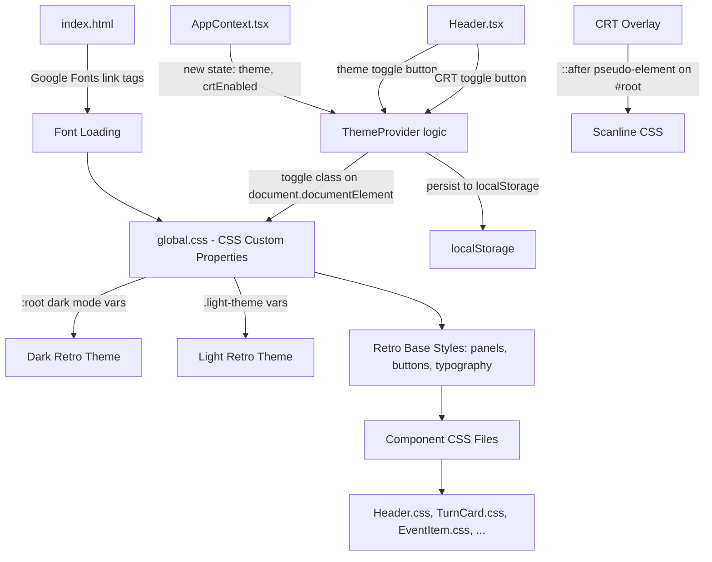

# Design Document: Retro Pixel Restyling

## Overview

This design transforms the Pokemon TCG Log Visualizer from its current modern UI theme into a retro/pixel-art aesthetic inspired by C64-era computing. The restyling is purely visual — no business logic, data flow, or component hierarchy changes. The approach centers on:

1. Replacing CSS custom properties in `global.css` with a retro C64-inspired palette (dark and light modes)
2. Loading two Google Fonts ("Press Start 2P" for headings, "VT323" for body) and wiring them through CSS variables
3. Applying a consistent "Retro Panel" pattern (3px solid border, 4px box-shadow, 0px border-radius) across all card/container components
4. Adding new UI capabilities: theme toggle button, CRT scanline overlay toggle, retro loading animation, status indicator, toast notifications, and modal overlay
5. Updating every component CSS file to replace rounded corners, gradients, and soft shadows with sharp pixel-art equivalents

The existing React component tree, state management (`AppContext` + `useReducer`), parser, and API layers remain untouched. New state is limited to theme preference and CRT overlay toggle, managed via React context and persisted to `localStorage`.

## Architecture

### High-Level Approach



### Change Strategy

The restyling follows a layered approach:

1. **Foundation Layer** — `index.html` gets Google Fonts `<link>` tags. `global.css` gets the full retro variable set, base typography rules, and reusable `.retro-panel` / `.pixel-btn` utility classes.
2. **Theme Layer** — Dark mode is default (`:root`). Light mode is activated by adding `.light-theme` class to `<html>`. A new `ThemeContext` (or extension of `AppContext`) manages the toggle and localStorage persistence.
3. **Component Layer** — Each component CSS file is updated to use retro variables: 0px border-radius, solid borders, pixel box-shadows, correct font families. No component TSX changes needed except Header (toggle buttons) and new utility components.
4. **New Components Layer** — Small new components/utilities: `ToastNotification`, `ModalOverlay`, `StatusIndicator`, and CRT overlay (CSS-only via pseudo-element).

### File Change Map

| File | Change Type | Description |
|------|-------------|-------------|
| `index.html` | Modify | Add Google Fonts `<link>` tags for "Press Start 2P" and "VT323" |
| `src/styles/global.css` | Major rewrite | Replace all CSS custom properties with retro palette, add retro base classes |
| `src/index.css` | Modify | Update button/link base styles for retro theme |
| `src/App.css` | Modify | Update view toggle, error banner to retro styling |
| `src/App.tsx` | Modify | Add CRT overlay class toggle, wire theme context |
| `src/context/AppContext.tsx` | Modify | Add `theme` and `crtEnabled` state, toggle actions, localStorage persistence |
| `src/components/Header.tsx` | Modify | Add theme toggle and CRT toggle buttons |
| `src/components/Header.css` | Modify | Ridge border, retro button styling for toggles |
| `src/components/TurnCard.css` | Modify | Retro panel styling |
| `src/components/EventItem.css` | Modify | Solid backgrounds, 0px radius, pixel font badges |
| `src/components/TimelineView.css` | Modify | Body font for detail text, retro borders |
| `src/components/StatisticsView.css` | Modify | Solid colors (no gradients), 0px radius bars |
| `src/components/PlayerStatsCard.css` | Modify | Retro panel styling, use CSS variables |
| `src/components/DeckAnalysisView.css` | Modify | Retro panel styling |
| `src/components/DeckCardDisplay.css` | Modify | Retro panel, solid borders |
| `src/components/DeckCategorySection.tsx` | Modify | Heading font with dashed underline (if CSS needed) |
| `src/components/LogInputForm.css` | Modify | Retro textarea, pixel font labels |
| `src/components/LoadingSpinner.css` | Major rewrite | Replace circular spinner with pixel block animation |
| `src/components/LoadingSpinner.tsx` | Modify | Update markup for pixel-art loading animation |
| `src/components/ErrorBoundary.css` | Modify | Retro panel for content box |
| `src/components/PokemonSprite.css` | Modify | 0px radius, solid border, pixel blink loading |
| New: `src/components/ToastNotification.tsx` | Create | Retro-styled toast component |
| New: `src/components/ToastNotification.css` | Create | Toast styling |
| New: `src/components/ModalOverlay.tsx` | Create | Retro modal dialog component |
| New: `src/components/ModalOverlay.css` | Create | Modal styling |
| New: `src/components/StatusIndicator.tsx` | Create | Pulsing square status dot |
| New: `src/components/StatusIndicator.css` | Create | Status indicator styling |

## Components and Interfaces

### Theme State Extension

The existing `AppContext` will be extended with theme-related state and actions:

```typescript
// New state fields added to AppState
interface ThemeState {
  theme: 'dark' | 'light'
  crtEnabled: boolean
}

// New action types
type ThemeAction =
  | { type: 'TOGGLE_THEME' }
  | { type: 'SET_THEME'; payload: 'dark' | 'light' }
  | { type: 'TOGGLE_CRT' }
  | { type: 'SET_CRT'; payload: boolean }
```

On `TOGGLE_THEME`, the reducer:
1. Flips `theme` between `'dark'` and `'light'`
2. Adds/removes `.light-theme` class on `document.documentElement`
3. Persists to `localStorage` key `'retro-theme'`

On `TOGGLE_CRT`, the reducer:
1. Flips `crtEnabled`
2. Adds/removes `.crt-enabled` class on `document.documentElement`
3. Persists to `localStorage` key `'retro-crt'`

Initial values are read from `localStorage` on app mount, defaulting to `'dark'` and `false`.

### Header Component Changes

```typescript
// Updated HeaderProps
interface HeaderProps {
  currentView?: 'input' | 'results'
  onNavigateToInput?: () => void
  showBackButton?: boolean
  theme: 'dark' | 'light'
  crtEnabled: boolean
  onToggleTheme: () => void
  onToggleCrt: () => void
}
```

The Header renders two new `Pixel_Button` styled buttons in the header-content area:
- "☀/🌙" theme toggle button
- "CRT" scanline toggle button

### ToastNotification Component

```typescript
interface ToastNotificationProps {
  message: string
  type?: 'info' | 'success' | 'error'
  duration?: number // ms, default 3000
  onDismiss: () => void
}
```

Renders a fixed-position element (bottom-right) with retro panel styling. Auto-dismisses after `duration` ms. Uses `Heading_Font` for text.

### ModalOverlay Component

```typescript
interface ModalOverlayProps {
  isOpen: boolean
  title: string
  children: React.ReactNode
  onClose: () => void
}
```

Renders a dark semi-transparent backdrop with a centered retro-panel dialog box. Title uses `Heading_Font`, body uses `Body_Font`.

### StatusIndicator Component

```typescript
interface StatusIndicatorProps {
  active?: boolean // true = pulsing, false = static
  size?: 'small' | 'medium'
}
```

Renders a small square (not circle) dot. Green (#00ff00) with a CSS keyframe pulse when `active`, static when idle.

### CRT Overlay (CSS-only)

Implemented as a `::after` pseudo-element on `#root` when `.crt-enabled` is present on `<html>`:

```css
.crt-enabled #root::after {
  content: '';
  position: fixed;
  top: 0;
  left: 0;
  width: 100%;
  height: 100%;
  background: repeating-linear-gradient(
    0deg,
    rgba(0, 0, 0, 0.03) 0px,
    rgba(0, 0, 0, 0.03) 1px,
    transparent 1px,
    transparent 2px
  );
  pointer-events: none;
  z-index: var(--z-overlay);
}
```

### LoadingSpinner Redesign

The circular spinner is replaced with a pixel-art blinking block cursor animation:

```css
@keyframes blink-cursor {
  0%, 100% { opacity: 1; }
  50% { opacity: 0; }
}

.pixel-loader {
  display: flex;
  gap: 4px;
}

.pixel-loader__block {
  width: 12px;
  height: 12px;
  background-color: var(--color-primary);
  animation: blink-cursor 1s step-end infinite;
}

.pixel-loader__block:nth-child(2) { animation-delay: 0.2s; }
.pixel-loader__block:nth-child(3) { animation-delay: 0.4s; }
```

## Data Models

### CSS Custom Properties — Retro Palette

**Dark Mode (`:root` default):**

| Variable | Value | Usage |
|----------|-------|-------|
| `--bg-primary` | `#352879` | Deep blue page background |
| `--bg-secondary` | `#40318d` | Panel/card backgrounds |
| `--bg-tertiary` | `#2a1f6e` | Nested containers |
| `--bg-elevated` | `#4a3a9e` | Elevated surfaces |
| `--color-primary` | `#6abfc6` | Teal accent, links, active states |
| `--color-primary-hover` | `#7dd3d9` | Teal hover |
| `--color-secondary` | `#887ecb` | Purple accent, player 2 |
| `--color-secondary-hover` | `#9a91d6` | Purple hover |
| `--text-primary` | `#e0e0e0` | Main text |
| `--text-secondary` | `#b0b0c0` | Secondary text |
| `--text-tertiary` | `#8080a0` | Muted text |
| `--border-primary` | `#6abfc6` | Panel borders (teal) |
| `--shadow-color` | `rgba(0, 0, 0, 0.5)` | Box-shadow color |

**Light Mode (`.light-theme`):**

| Variable | Value | Usage |
|----------|-------|-------|
| `--bg-primary` | `#e0e0e0` | Light gray page background |
| `--bg-secondary` | `#f5f5f5` | White panel backgrounds |
| `--bg-tertiary` | `#d5d5d5` | Nested containers |
| `--bg-elevated` | `#ffffff` | Elevated surfaces |
| `--color-primary` | `#352879` | Deep blue accent |
| `--color-primary-hover` | `#2a1f6e` | Blue hover |
| `--color-secondary` | `#887ecb` | Purple accent |
| `--text-primary` | `#1a1a2e` | Main text |
| `--text-secondary` | `#3a3a5e` | Secondary text |
| `--text-tertiary` | `#6a6a8e` | Muted text |
| `--border-primary` | `#352879` | Panel borders (blue) |
| `--shadow-color` | `rgba(0, 0, 0, 0.25)` | Box-shadow color |

**Shared (both modes):**

| Variable | Value | Usage |
|----------|-------|-------|
| `--font-heading` | `'Press Start 2P', 'Courier New', monospace` | Headings, labels, buttons |
| `--font-body` | `'VT323', 'Courier New', monospace` | Body text, inputs, content |
| `--font-size-heading-lg` | `1rem` | H1 (smaller due to pixel font weight) |
| `--font-size-heading-md` | `0.75rem` | H2-H3 |
| `--font-size-heading-sm` | `0.625rem` | H4-H6, buttons, badges |
| `--font-size-body-lg` | `1.5rem` | Large body text |
| `--font-size-body-md` | `1.25rem` | Normal body text |
| `--font-size-body-sm` | `1rem` | Small body text |
| `--radius-sm` | `0px` | All border-radius values |
| `--radius-md` | `0px` | |
| `--radius-lg` | `0px` | |
| `--radius-xl` | `0px` | |
| `--radius-full` | `0px` | |
| `--retro-border` | `3px solid var(--border-primary)` | Standard retro border |
| `--retro-shadow` | `4px 4px 0px var(--shadow-color)` | Standard retro box-shadow |

### localStorage Keys

| Key | Type | Default | Description |
|-----|------|---------|-------------|
| `retro-theme` | `'dark' \| 'light'` | `'dark'` | User's theme preference |
| `retro-crt` | `'true' \| 'false'` | `'false'` | CRT overlay toggle state |


## Correctness Properties

*A property is a characteristic or behavior that should hold true across all valid executions of a system — essentially, a formal statement about what the system should do. Properties serve as the bridge between human-readable specifications and machine-verifiable correctness guarantees.*

### Property 1: Theme variable resolution

*For any* theme mode (dark or light), all CSS custom properties defined in the retro palette should resolve to the correct values for that mode. Toggling the theme should switch every variable to the alternate mode's value set.

**Validates: Requirements 1.4, 7.1, 7.2**

### Property 2: Theme persistence round-trip

*For any* theme value ('dark' or 'light'), setting the theme, persisting to localStorage, and reading it back on a fresh page load should restore the same theme mode.

**Validates: Requirements 7.4**

### Property 3: Heading font application

*For any* heading element (h1–h6), label element, or button element in the application, the computed `font-family` should include "Press Start 2P" as the primary font, with `text-transform: uppercase` on buttons.

**Validates: Requirements 2.4, 4.1**

### Property 4: Body font application

*For any* body text element, paragraph, or form input element, the computed `font-family` should include "VT323" as the primary font.

**Validates: Requirements 2.5**

### Property 5: Font fallback stacks

*For any* element using a retro font (heading or body), the CSS `font-family` declaration should include "Courier New" and `monospace` as fallback values after the primary Google Font.

**Validates: Requirements 18.2, 18.3**

### Property 6: Retro Panel styling consistency

*For any* component designated as a Retro_Panel (TurnCard, PlayerStatsCard, DeckCardDisplay, DeckCategorySection, ErrorBoundary content box, LogInputForm container), the rendered element should have a 3px solid border using the theme's border color, a `4px 4px 0px` box-shadow using the theme's shadow color, and `0px` border-radius.

**Validates: Requirements 3.1, 3.2, 3.3, 3.5**

### Property 7: Panel label dashed underline

*For any* Retro_Panel that contains a label or section title, the label element should have a dashed `border-bottom` or `text-decoration` style rendering a dashed underline.

**Validates: Requirements 3.4**

### Property 8: Pixel Button base styling

*For any* interactive button element in the application, the element should have a 3px solid border, `4px 4px 0px` box-shadow, and `0px` border-radius.

**Validates: Requirements 4.2, 4.3, 4.6**

### Property 9: Button hover effect

*For any* Pixel_Button element, when hovered, the element's computed `transform` should include `translateY(-2px)` and the box-shadow offset should increase to `6px`.

**Validates: Requirements 4.4**

### Property 10: Button active effect

*For any* Pixel_Button element, when in the active (pressed) state, the element's computed `transform` should include `translateY(2px)` and the box-shadow should be `0px` (or inset).

**Validates: Requirements 4.5**

### Property 11: Global zero border-radius

*For any* element in the application that has a visible border or previously had a non-zero border-radius (including form inputs, textareas, badges, bar fills, and scrollbar thumbs), the computed `border-radius` should be `0px`.

**Validates: Requirements 6.1, 6.2, 6.3**

### Property 12: CRT overlay toggle

*For any* CRT enabled/disabled state, toggling the CRT control should flip the visibility of the scanline overlay pseudo-element. When disabled, no scanline pseudo-element should be rendered; when enabled, the pseudo-element should exist with `pointer-events: none`.

**Validates: Requirements 8.3, 8.4**

### Property 13: Status indicator square shape

*For any* rendered StatusIndicator component, the element should have equal width and height with `0px` border-radius (square, not circle).

**Validates: Requirements 10.1**

### Property 14: Status indicator idle state

*For any* StatusIndicator in idle mode (`active=false`), the element should display a static green dot with no pulsing animation (animation is `none` or paused).

**Validates: Requirements 10.3**

### Property 15: Toast auto-dismiss timing

*For any* ToastNotification rendered with a given `duration` value, the toast should auto-dismiss (call `onDismiss`) after approximately that duration in milliseconds.

**Validates: Requirements 11.4**

### Property 16: Textarea focus border styling

*For any* focus event on the LogInputForm textarea, the border-color should change to the retro accent color and the `box-shadow` should be `none` (no glow effect, solid color change only).

**Validates: Requirements 13.3**

### Property 17: EventItem solid backgrounds

*For any* EventItem component, the background-color should be a solid color (alpha = 1, no `rgba` with alpha < 1) and border-radius should be `0px`.

**Validates: Requirements 14.3**

### Property 18: Statistics bars use solid colors

*For any* comparison bar fill in the StatisticsView, the `background` or `background-image` should be a solid color with no CSS gradient (`linear-gradient`, `radial-gradient`, etc.).

**Validates: Requirements 15.1**

### Property 19: Responsive font scaling below 768px

*For any* viewport width less than 768px, the computed font sizes for pixel fonts should be proportionally smaller than the desktop (≥768px) font sizes.

**Validates: Requirements 17.1**

### Property 20: Responsive shadow/border reduction below 480px

*For any* viewport width less than 480px, the box-shadow offsets and border widths on retro-styled elements should be reduced compared to their desktop values.

**Validates: Requirements 17.2**

## Error Handling

### Font Loading Failures

- Google Fonts are loaded via `<link>` tags with `font-display: swap`, ensuring text remains visible with fallback fonts during loading.
- CSS font stacks always include `'Courier New', monospace` as fallbacks, so the retro aesthetic degrades gracefully to a monospace look.
- No JavaScript font-loading detection is needed; CSS handles the fallback chain natively.

### Theme State Errors

- If `localStorage` is unavailable (private browsing, storage quota), the theme defaults to `'dark'` and CRT defaults to `false`. The `try/catch` around `localStorage.getItem`/`setItem` prevents crashes.
- Invalid values in `localStorage` (e.g., corrupted data) are handled by falling back to defaults.

### CRT Overlay Edge Cases

- The CRT overlay uses `pointer-events: none` to ensure it never blocks user interaction.
- The overlay uses a fixed z-index below toast/modal layers to avoid stacking conflicts.

### Toast Notification Edge Cases

- Multiple toasts stack vertically with a gap, each with its own auto-dismiss timer.
- If `duration` is 0 or negative, the toast does not auto-dismiss (manual dismiss only).

### Modal Overlay

- Pressing Escape or clicking the backdrop closes the modal.
- Focus is trapped within the modal when open for accessibility.
- Body scroll is locked when modal is open.

## Testing Strategy

### Dual Testing Approach

This feature requires both unit tests and property-based tests:

- **Unit tests**: Verify specific examples (e.g., dark mode has `#352879` background, Header has ridge border, LoadingSpinner renders pixel blocks).
- **Property-based tests**: Verify universal properties across all components and states (e.g., all panels have retro styling, all buttons have pixel styling, theme toggle round-trips correctly).

### Property-Based Testing Configuration

- **Library**: [fast-check](https://github.com/dubzzz/fast-check) for TypeScript/JavaScript property-based testing
- **Minimum iterations**: 100 per property test
- **Test tagging**: Each property test must include a comment referencing the design property:
  ```
  // Feature: retro-pixel-restyling, Property 1: Theme variable resolution
  ```
- **Each correctness property is implemented by a single property-based test**

### Test Categories

**Property-Based Tests (fast-check)**:
- Theme variable resolution across modes (Property 1)
- Theme persistence round-trip via localStorage (Property 2)
- Heading font application across all heading/label/button elements (Property 3)
- Body font application across all text/input elements (Property 4)
- Font fallback stack verification (Property 5)
- Retro Panel styling across all panel components (Property 6)
- Panel label dashed underline (Property 7)
- Pixel Button styling across all buttons (Property 8)
- Button hover/active effects (Properties 9, 10)
- Global zero border-radius across all bordered elements (Property 11)
- CRT overlay toggle behavior (Property 12)
- Status indicator shape and idle state (Properties 13, 14)
- Toast auto-dismiss timing (Property 15)
- Textarea focus styling (Property 16)
- EventItem solid backgrounds (Property 17)
- Statistics bars solid colors (Property 18)
- Responsive scaling properties (Properties 19, 20)

**Unit Tests (Vitest + React Testing Library)**:
- Dark mode specific color values (Req 1.1)
- Light mode specific color values (Req 1.2)
- Header ridge border presence (Req 5.1)
- LoadingSpinner renders pixel blocks, not circular spinner (Req 9.1)
- StatusIndicator renders with green color (Req 10.2)
- Modal overlay backdrop rendering (Req 12.1)
- Font link tags present in document head (Req 18.1)
- `font-display: swap` configured (Req 18.4)
- TurnCard left border accent preserved (Req 14.2)
- PokemonSprite pixel blink loading animation (Req 16.2)

### Test File Organization

```
src/
  components/
    __tests__/
      retro-styling.property.test.tsx   # All property-based tests
      retro-styling.unit.test.tsx       # All unit tests for specific examples
```
