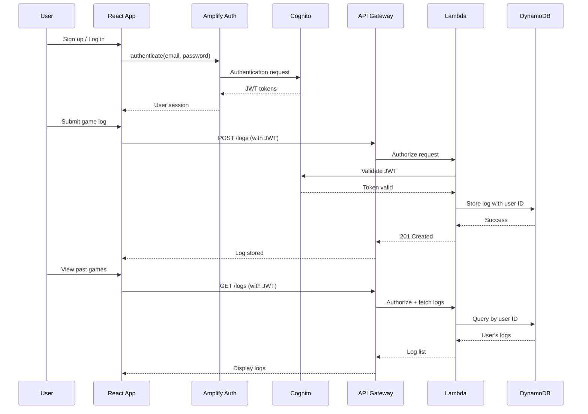

# Design Document: User Authentication and Log Storage

## Overview

This design implements user authentication and persistent log storage for the Pokemon TCG Log Visualizer. The system integrates AWS Cognito User Pool for authentication and AWS DynamoDB for storing game logs associated with user identities. The architecture maintains the existing client-side React application while adding backend services for authentication and data persistence.

The design follows a serverless architecture pattern using AWS managed services to minimize operational overhead. Authentication state is managed client-side using AWS Amplify libraries, while game logs are stored in DynamoDB with user-based partitioning for efficient retrieval. The system preserves the existing unauthenticated user experience while adding optional account creation for users who want persistent storage.

Key architectural decisions:
- AWS Cognito User Pool for authentication (managed service, built-in security features)
- DynamoDB for log storage (serverless, auto-scaling, pay-per-use)
- API Gateway + Lambda for backend API (serverless, integrates with Cognito)
- Client-side authentication state management using AWS Amplify
- Backward compatibility: unauthenticated users can still use visualization features

## Architecture

### System Components

The system consists of four primary layers:

1. **Frontend Layer (React + AWS Amplify)**
   - Existing React application with new authentication UI components
   - AWS Amplify Auth library for Cognito integration
   - Authentication state management in React Context
   - Past games list component for authenticated users

2. **Authentication Layer (AWS Cognito)**
   - Cognito User Pool for user identity management
   - Email + password authentication
   - JWT token generation and validation
   - Session management with refresh tokens

3. **API Layer (API Gateway + Lambda)**
   - REST API endpoints for log operations
   - Lambda authorizer for JWT validation
   - CORS configuration for CloudFront origin
   - Request/response transformation

4. **Data Layer (DynamoDB)**
   - Single table design for game logs
   - User ID as partition key
   - Log ID as sort key
   - GSI for timestamp-based queries

### Component Interactions



### Data Flow

**Authentication Flow:**
1. User enters credentials in login form
2. Amplify Auth sends request to Cognito User Pool
3. Cognito validates credentials and returns JWT tokens (ID token, access token, refresh token)
4. Amplify stores tokens securely in browser storage
5. React app updates authentication state in context
6. UI updates to show authenticated user experience

**Log Storage Flow:**
1. Authenticated user submits game log
2. React app includes JWT in API request header
3. API Gateway validates JWT using Lambda authorizer
4. Lambda function extracts user ID from JWT claims
5. Lambda stores log in DynamoDB with user ID as partition key
6. DynamoDB returns success confirmation
7. React app updates UI to show success message

**Log Retrieval Flow:**
1. Authenticated user navigates to past games view
2. React app requests logs from API with JWT
3. API Gateway validates JWT
4. Lambda queries DynamoDB by user ID
5. DynamoDB returns all logs for that user
6. Lambda sorts by timestamp (descending)
7. React app displays logs in Past Games List component

## Components and Interfaces

### Frontend Components

#### AuthContext
Manages authentication state across the application.

```typescript
interface AuthState {
  isAuthenticated: boolean
  user: CognitoUser | null
  isLoading: boolean
  error: string | null
}

interface AuthContextValue {
  state: AuthState
  signUp: (email: string, password: string) => Promise<void>
  signIn: (email: string, password: string) => Promise<void>
  signOut: () => Promise<void>
  getCurrentUser: () => Promise<CognitoUser | null>
}
```

#### AuthUI Component
Provides login, signup, and logout UI.

```typescript
interface AuthUIProps {
  onAuthSuccess?: () => void
}

// Renders:
// - Login form (email, password, submit button)
// - Signup form (email, password, confirm password, submit button)
// - Toggle between login/signup modes
// - Error messages
// - Loading states
```

#### PastGamesList Component
Displays previously uploaded game logs for authenticated users.

```typescript
interface PastGamesListProps {
  onSelectLog: (log: GameLog) => void
}

interface GameLog {
  logId: string
  userId: string
  content: string
  timestamp: number
  createdAt: string
}
```

#### LogStorageService
Client-side service for interacting with the log storage API.

```typescript
interface LogStorageService {
  storeLog(content: string, token: string): Promise<{ logId: string }>
  getLogs(token: string): Promise<GameLog[]>
  getLog(logId: string, token: string): Promise<GameLog>
}
```

### Backend Components

#### Lambda Functions

**StoreLogFunction**
- Handler: `storeLog(event, context)`
- Input: `{ body: { content: string }, requestContext: { authorizer: { claims: { sub: string } } } }`
- Output: `{ statusCode: 201, body: { logId: string, timestamp: number } }`
- Responsibilities:
  - Extract user ID from JWT claims
  - Generate unique log ID (UUID)
  - Store log in DynamoDB
  - Return log ID and timestamp

**GetLogsFunction**
- Handler: `getLogs(event, context)`
- Input: `{ requestContext: { authorizer: { claims: { sub: string } } } }`
- Output: `{ statusCode: 200, body: { logs: GameLog[] } }`
- Responsibilities:
  - Extract user ID from JWT claims
  - Query DynamoDB for all user logs
  - Sort by timestamp descending
  - Return log list

**GetLogFunction**
- Handler: `getLog(event, context)`
- Input: `{ pathParameters: { logId: string }, requestContext: { authorizer: { claims: { sub: string } } } }`
- Output: `{ statusCode: 200, body: GameLog }`
- Responsibilities:
  - Extract user ID from JWT claims
  - Retrieve specific log from DynamoDB
  - Verify log belongs to requesting user
  - Return log content

#### API Gateway Configuration

**Endpoints:**
- `POST /logs` - Store a new game log
- `GET /logs` - Retrieve all logs for authenticated user
- `GET /logs/{logId}` - Retrieve specific log by ID

**Authorization:**
- Cognito User Pool authorizer attached to all endpoints
- JWT validation on every request
- User ID extracted from `sub` claim in JWT

**CORS Configuration:**
```yaml
AllowOrigin: CloudFront distribution domain
AllowMethods: GET, POST, OPTIONS
AllowHeaders: Content-Type, Authorization
AllowCredentials: true
```

## Data Models

### DynamoDB Table Schema

**Table Name:** `GameLogs`

**Primary Key:**
- Partition Key: `userId` (String) - Cognito user ID from `sub` claim
- Sort Key: `logId` (String) - UUID generated for each log

**Attributes:**
- `userId` (String, required) - Cognito user ID
- `logId` (String, required) - Unique log identifier
- `content` (String, required) - Full game log text
- `timestamp` (Number, required) - Unix timestamp of upload
- `createdAt` (String, required) - ISO 8601 timestamp for display

**Global Secondary Index (Optional):**
- Index Name: `TimestampIndex`
- Partition Key: `userId`
- Sort Key: `timestamp`
- Purpose: Efficient timestamp-based queries (already supported by sort key on main table)

**Access Patterns:**
1. Store new log: `PutItem` with userId and generated logId
2. Get all user logs: `Query` with userId, sorted by logId
3. Get specific log: `GetItem` with userId and logId
4. Verify ownership: Check userId matches JWT claim before returning

**Capacity Planning:**
- On-demand billing mode (auto-scaling)
- Expected item size: ~10-50 KB per log
- Expected access pattern: Write-heavy during gameplay, read-heavy when viewing history

### Cognito User Pool Configuration

**User Attributes:**
- `email` (required, used as username)
- `email_verified` (auto-verified for simplicity, or require verification)

**Password Policy:**
- Minimum length: 8 characters
- Require uppercase: Yes
- Require lowercase: Yes
- Require numbers: Yes
- Require symbols: Optional

**MFA:** Disabled (can be enabled later)

**Token Expiration:**
- ID token: 1 hour
- Access token: 1 hour
- Refresh token: 30 days

### Frontend State Models

**AuthState:**
```typescript
interface AuthState {
  isAuthenticated: boolean
  user: {
    userId: string
    email: string
  } | null
  tokens: {
    idToken: string
    accessToken: string
    refreshToken: string
  } | null
  isLoading: boolean
  error: string | null
}
```

**GameLog:**
```typescript
interface GameLog {
  logId: string
  userId: string
  content: string
  timestamp: number
  createdAt: string // ISO 8601 format for display
}
```

**PastGamesState:**
```typescript
interface PastGamesState {
  logs: GameLog[]
  isLoading: boolean
  error: string | null
  selectedLogId: string | null
}
```


## Correctness Properties

*A property is a characteristic or behavior that should hold true across all valid executions of a system-essentially, a formal statement about what the system should do. Properties serve as the bridge between human-readable specifications and machine-verifiable correctness guarantees.*

### Property Reflection

After analyzing the acceptance criteria, I identified several areas where properties can be consolidated:

**Redundancy Analysis:**
- Properties 2.1 (store with user ID) and 3.2 (retrieve by user ID) are related but test different aspects - storage association vs retrieval filtering
- Properties 2.2 (store as text) and the round-trip nature of storage can be combined into a single serialization property
- Properties 6.1, 6.2, 6.3 (network errors) can be combined into a single property about error handling across all operations
- Properties 1.4 (valid auth) and 4.1 (token storage) are sequential but test different aspects - authentication vs token persistence
- Properties 3.3 (display timestamp) and 3.4 (sort by timestamp) both involve timestamps but test different behaviors

**Consolidated Properties:**
- Combine log content storage and retrieval into a round-trip property
- Combine all network error handling into a single property with different operation types
- Keep authentication and token storage separate as they test different system behaviors

### Property 1: Authentication with valid credentials returns user identity

*For any* valid email and password combination, when a user authenticates, the system should return a user ID and authentication tokens.

**Validates: Requirements 1.4**

### Property 2: Invalid credentials produce error messages

*For any* invalid credential combination (wrong password, non-existent email, malformed input), the authentication system should return a descriptive error message and not authenticate the user.

**Validates: Requirements 1.5**

### Property 3: Logout transitions to unauthenticated state

*For any* authenticated user session, when the user logs out, the system should clear authentication tokens and transition to an unauthenticated state.

**Validates: Requirements 1.7**

### Property 4: Authentication persists across browser refresh

*For any* authenticated user session, when the browser is refreshed, the system should restore the authenticated session using stored tokens.

**Validates: Requirements 1.8**

### Property 5: UI reflects authentication state changes

*For any* authentication state change (login, logout, session restore), the UI should update to reflect the current authentication status within a reasonable time.

**Validates: Requirements 1.9**

### Property 6: Log storage round-trip preserves content

*For any* game log content submitted by an authenticated user, storing and then retrieving that log should return content identical to the original submission.

**Validates: Requirements 2.1, 2.2**

### Property 7: Stored logs include timestamps

*For any* game log stored by an authenticated user, the stored log should include a timestamp indicating when it was uploaded.

**Validates: Requirements 2.3**

### Property 8: Each stored log has a unique identifier

*For any* set of game logs stored by users, each log should have a unique identifier that distinguishes it from all other logs.

**Validates: Requirements 2.4**

### Property 9: Storage failures return error messages

*For any* log storage operation that fails (network error, service unavailable, invalid data), the system should return a descriptive error message to the user.

**Validates: Requirements 2.5**

### Property 10: Retrieved logs belong to authenticated user

*For any* authenticated user requesting their game logs, all retrieved logs should be associated with that user's ID and no other user's logs should be included.

**Validates: Requirements 3.2, 5.5**

### Property 11: Past games display includes timestamps

*For any* game log displayed in the past games list, the display should include the upload timestamp.

**Validates: Requirements 3.3**

### Property 12: Past games sorted by timestamp descending

*For any* list of past games retrieved for a user, the logs should be sorted in reverse chronological order with the most recent log first.

**Validates: Requirements 3.4**

### Property 13: Clicking a past game loads and visualizes it

*For any* game log in the past games list, when a user clicks on it, the application should load that log's content and display the visualization.

**Validates: Requirements 3.5**

### Property 14: Authentication stores tokens securely

*For any* successful authentication, the system should store authentication tokens in browser storage (localStorage or sessionStorage) for session persistence.

**Validates: Requirements 4.1**

### Property 15: Valid tokens restore authenticated session

*For any* valid authentication token stored in the browser, when the application loads, the system should restore the authenticated session without requiring re-login.

**Validates: Requirements 4.3**

### Property 16: Expired tokens trigger re-authentication

*For any* expired authentication token, when the application attempts to use it, the system should prompt the user to log in again.

**Validates: Requirements 4.4**

### Property 17: Unauthorized access returns authentication error

*For any* API request made without valid authentication tokens, the backend service should return an authentication error and not process the request.

**Validates: Requirements 5.6**

### Property 18: Network errors display user-friendly messages

*For any* network error occurring during authentication, log storage, or log retrieval operations, the application should display a user-friendly error message to the user.

**Validates: Requirements 6.1, 6.2, 6.3**

### Property 19: Error messages distinguish error types

*For any* error that occurs (authentication error, authorization error, system error), the error message should clearly indicate the type of error to help users understand what went wrong.

**Validates: Requirements 6.4**

### Property 20: Operations display loading indicators

*For any* asynchronous operation (authentication, log storage, log retrieval), the application should display a loading indicator while the operation is in progress.

**Validates: Requirements 6.5**

### Property 21: Successful operations show confirmation

*For any* operation that completes successfully (login, log storage, log retrieval), the application should provide visual confirmation to the user.

**Validates: Requirements 6.6**

### Property 22: Unauthenticated users can visualize logs

*For any* game log submitted by an unauthenticated user, the application should visualize the log without requiring authentication or storing it.

**Validates: Requirements 7.1, 7.3, 7.4**

## Error Handling

### Authentication Errors

**Error Categories:**
1. **Invalid Credentials** - Wrong password or non-existent email
2. **Network Errors** - Connection timeout, DNS failure, service unavailable
3. **Validation Errors** - Malformed email, weak password, missing fields
4. **Session Errors** - Expired tokens, invalid tokens, missing tokens

**Error Handling Strategy:**
- All errors caught at the service layer (AuthService)
- Errors transformed into user-friendly messages
- Error state stored in AuthContext for UI display
- Automatic retry for transient network errors (with exponential backoff)
- Clear error messages with actionable guidance

**Example Error Messages:**
- "Invalid email or password. Please try again."
- "Unable to connect to authentication service. Please check your internet connection."
- "Your session has expired. Please log in again."
- "Password must be at least 8 characters with uppercase, lowercase, and numbers."

### Log Storage Errors

**Error Categories:**
1. **Authentication Errors** - Missing or invalid JWT token
2. **Authorization Errors** - User attempting to access another user's logs
3. **Validation Errors** - Empty log content, invalid format
4. **Storage Errors** - DynamoDB service errors, capacity exceeded
5. **Network Errors** - API Gateway timeout, connection failure

**Error Handling Strategy:**
- Lambda functions return structured error responses with HTTP status codes
- Frontend service layer catches and categorizes errors
- Retry logic for transient failures (5xx errors)
- No retry for client errors (4xx errors)
- Error state managed in application context

**HTTP Status Codes:**
- 400 Bad Request - Invalid log content or malformed request
- 401 Unauthorized - Missing or invalid authentication token
- 403 Forbidden - User attempting to access another user's log
- 500 Internal Server Error - DynamoDB or Lambda failure
- 503 Service Unavailable - Temporary service outage

### UI Error Display

**Error Display Patterns:**
1. **Inline Errors** - Form validation errors displayed next to input fields
2. **Banner Errors** - Network and service errors displayed in prominent banner
3. **Toast Notifications** - Transient errors shown as dismissible toasts
4. **Modal Dialogs** - Critical errors requiring user acknowledgment

**Error Recovery:**
- Retry buttons for network errors
- Clear error state when user takes corrective action
- Preserve user input when errors occur
- Graceful degradation (unauthenticated mode still works)

## Testing Strategy

### Dual Testing Approach

This feature requires both unit tests and property-based tests for comprehensive coverage:

**Unit Tests** focus on:
- Specific examples of authentication flows (successful login, failed login)
- Edge cases (empty email, malformed password, expired tokens)
- Integration points (Amplify Auth integration, API Gateway calls)
- UI component rendering (login form, past games list, error messages)
- Error conditions (network failures, service errors)

**Property-Based Tests** focus on:
- Universal properties that hold for all inputs (authentication round-trips, log storage/retrieval)
- Comprehensive input coverage through randomization (various email formats, password combinations)
- State transitions (authentication state changes, session persistence)
- Data integrity (log content preservation, user isolation)

### Property-Based Testing Configuration

**Library:** fast-check (already in package.json)

**Configuration:**
- Minimum 100 iterations per property test
- Each test tagged with feature name and property number
- Tag format: `Feature: user-authentication-and-log-storage, Property {N}: {property description}`

**Example Property Test Structure:**
```typescript
import fc from 'fast-check'
import { describe, it, expect } from 'vitest'

describe('Feature: user-authentication-and-log-storage', () => {
  it('Property 6: Log storage round-trip preserves content', () => {
    fc.assert(
      fc.property(
        fc.string({ minLength: 1, maxLength: 10000 }), // Game log content
        async (logContent) => {
          // Store log
          const { logId } = await storeLog(logContent, authToken)
          
          // Retrieve log
          const retrievedLog = await getLog(logId, authToken)
          
          // Verify content matches
          expect(retrievedLog.content).toBe(logContent)
        }
      ),
      { numRuns: 100 }
    )
  })
})
```

### Unit Testing Strategy

**Frontend Unit Tests:**
- AuthContext state management
- AuthUI component rendering and interactions
- PastGamesList component rendering and selection
- LogStorageService API calls
- Error message display
- Loading indicator display

**Backend Unit Tests:**
- Lambda function handlers
- JWT token validation
- DynamoDB operations (mocked)
- Error response formatting
- CORS header configuration

**Integration Tests:**
- End-to-end authentication flow
- Log storage and retrieval flow
- Session persistence across page refresh
- Unauthenticated user experience

### Test Coverage Goals

- Unit test coverage: >80% for all new code
- Property test coverage: All 22 correctness properties implemented
- Integration test coverage: All critical user flows
- Error handling coverage: All error categories tested

### Testing Tools

- **Vitest** - Test runner (already configured)
- **fast-check** - Property-based testing library (already in package.json)
- **@testing-library/react** - React component testing (already in package.json)
- **AWS SDK Mocks** - Mock AWS services for unit tests
- **MSW (Mock Service Worker)** - Mock API calls for integration tests

